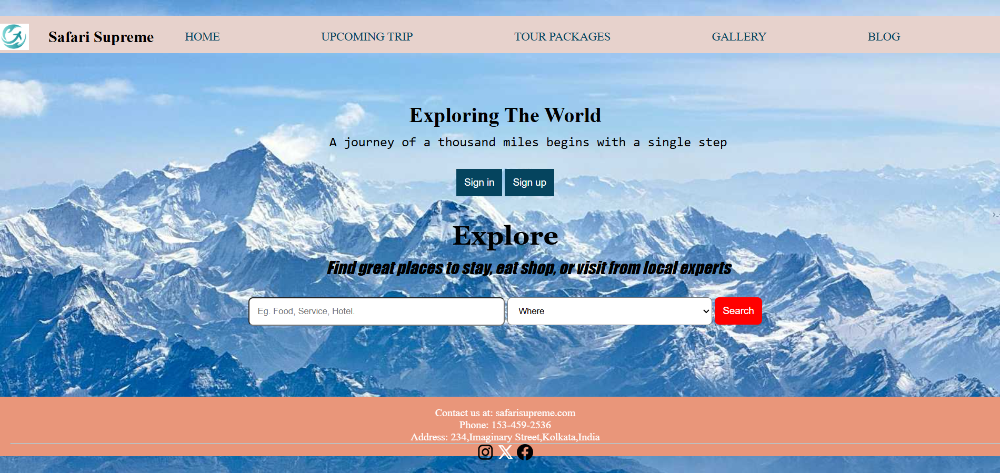
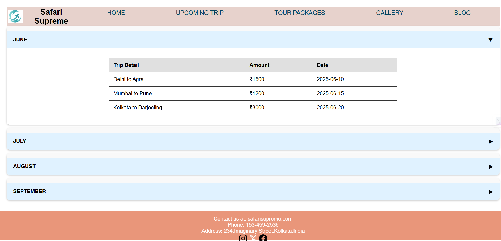
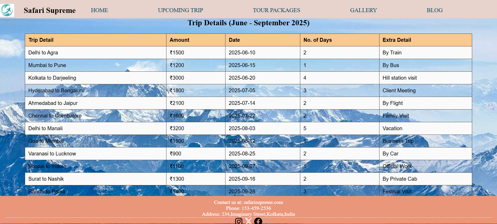
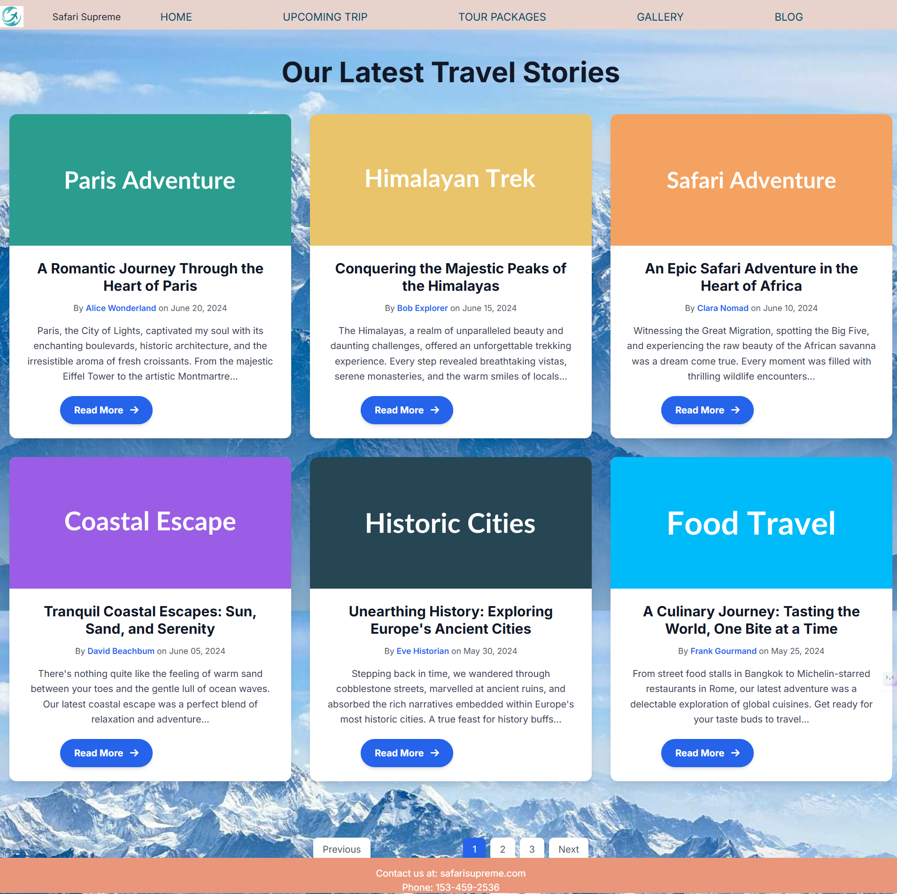

# ✈️ Tourism Web Design 🌍

## ✨ Project Overview

Welcome to the **Tourism Web Design** repository\!

This project is a modern, responsive, and visually captivating web design template specifically crafted to bring the magic of travel to life online. Whether you're building a website for a bustling travel agency, a serene resort, an adventurous tour operator, or a comprehensive destination guide, this design provides a robust and beautiful foundation.

Our goal is to deliver a clean, intuitive, and highly attractive user interface that not only showcases destinations but also inspires wanderlust and simplifies the booking process for your users.

## 🚀 Key Features

  * **100% Responsive Design:** Looks stunning and functions flawlessly on any device – from large desktop monitors to tablets and smartphones. 📱💻
  * **Immersive Visuals:** Designed to highlight breathtaking landscapes and exciting activities with captivating imagery and thoughtful layouts. 🏞️📸
  * **Intuitive Navigation:** Easy-to-use menu structures ensure visitors can effortlessly find what they're looking for. 🧭
  * **Dedicated Showcase Sections:** Beautifully crafted areas for:
      * Popular Destinations 🗺️
      * Exciting Tour Packages  पैकेज 🎒
      * Authentic Testimonials ❤️
      * Featured Attractions 📍
  * **Booking & Contact Ready:** Layouts are designed to seamlessly integrate with booking forms, inquiry forms, and essential contact information. 📧📞
  * **Clean & Maintainable Code:** Well-organized HTML, CSS, and minimal JavaScript (if any) ensure easy customization and future scalability. ✨

## 🛠️ Technologies Used

This project leverages the power of fundamental web technologies to create a robust and flexible design:

  * **HTML5:** The backbone of our content structure. 📄
  * **CSS3:** For all the stunning styling, responsive layouts, and visual appeal. 🎨
  * **JavaScript (Optional/Minor):** For subtle interactive elements like carousels or smooth scrolling, if implemented. ⚡

## 💻 Screenshorts

    <h2 style="text-align: center;">Home Page</h2>
    
    <h2 style="text-align: center;">Upcoming Trip</h2>    
    
    <h2 style="text-align: center;">Tour Packages</h2>
    
    <h2 style="text-align: center;">Gallery</h2>
    
    <h2 style="text-align: center;">Blog</h2>


## 🚀 Getting Started

Ready to see it in action or start building your dream travel site? Follow these simple steps\!

### Prerequisites

All you need is a modern web browser (like Chrome, Firefox, Safari, Edge) to view this project. No complex setups required\! ✅

### Installation

1.  **Clone the repository to your local machine:**
    ```bash
    git clone https://github.com/amit35ha/tousrism-web-design.git
    ```
2.  **Navigate into the project directory:**
    ```bash
    cd tousrism-web-design
    ```
3.  **Open the `index.html` file in your favorite web browser:**
    ```bash
    # On most systems, simply:
    open index.html
    # Or locate the file in your file explorer and double-click it!
    ```
    Voila\! You should now see the beautiful design in your browser.

## 💡 How to Use

This repository is your canvas\! Use this design as a powerful starting point for your next tourism-related web project. Feel free to:

  * **Modify the HTML:** Add your own content, sections, and structure.
  * **Customize the CSS:** Change colors, fonts, layouts to match your brand.
  * **Integrate functionality:** Connect it to a backend, add booking systems, or dynamic content.

Let your creativity flow\! 🎨

## 🙏 Contributing

We believe in the power of collaboration\! Contributions, ideas, and suggestions are what make the open-source community thrive. If you have an awesome idea for an improvement or a new feature, we'd love to see it\!

Here's how you can contribute:

1.  **Fork the Project** ➡️
2.  **Create your Feature Branch** (`git checkout -b feature/YourAmazingFeature`)
3.  **Commit your Changes** (`git commit -m 'feat: Add some AmazingFeature'`)
4.  **Push to the Branch** (`git push origin feature/YourAmazingFeature`)
5.  **Open a Pull Request** (Tell us what you've done and why it's great\!)  Pull requests are always welcome\! ✨

Please ensure your code is clean, well-commented, and follows standard best practices.

## 📧 Contact

Got questions, feedback, or just want to connect?

Your Name - @min.e_35 (35ha) https://www.instagram.com/min.e_35/

Project Link: [https://github.com/amit35ha/tousrism-web-design](https://github.com/amit35ha/tousrism-web-design)

-----

Made with ❤️ for the travel community

